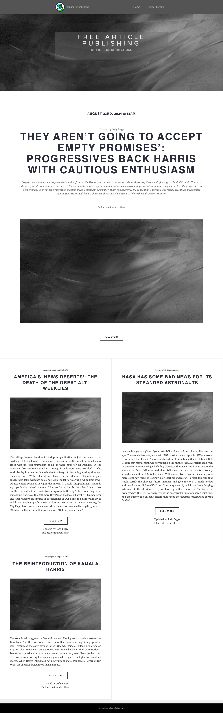
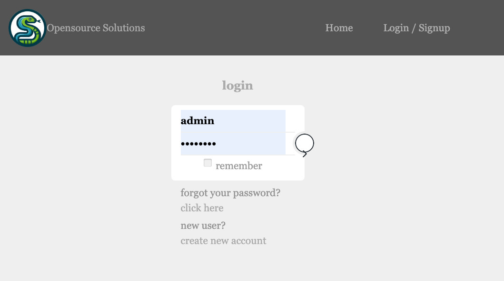
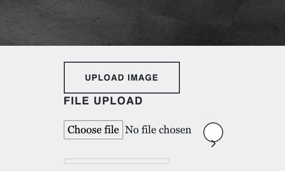
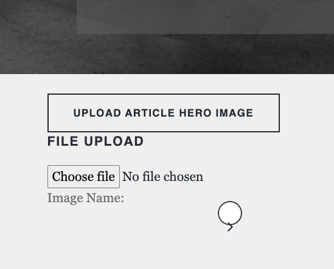

# Installation

### Software

#### This was developed on a Mac using VSCODE
Requirements

1. Node 10.8.2 installed locally
2. Python 3.10 atleast with virualebv installed (for development)
3. Docker using Docker Compose

Checkout the repository


```
git clone https://github.com/JBeggs/docker-django-react-web-application.git
```

And then change into the directory

```
cd docker-django-react-web-application
```

Before we can deploy the docker images and run the application we need to 

1. Check env variable files
2. Build Python app to test and manage locally
3. npm install node packages
4. run docker commands

Open .env.dev in your favourite editor and change the following lines

```
DEBUG=1
SECRET_KEY=lazypasswordsaretheshortestthestrongestseemtobealongstringmorethan256charctors!
DJANGO_ALLOWED_HOSTS=localhost 127.0.0.1 [::1] localhost:3000 192.168.50.106
SQL_ENGINE=django.db.backends.postgresql
SQL_DATABASE=backend_dev
SQL_USER=backend
SQL_PASSWORD=backend
SQL_HOST=db
SQL_PORT=5432
DATABASE=backend
```

Make sure 'DJANGO_ALLOWED_HOSTS' incldues your IP address

Now open frontend/.env in your favourite editor and change the following lines

```
REACT_APP_BACKEND_URL=http://192.168.50.106:8000
REACT_APP_PUBLIC_HTML=http://192.168.50.106:3000
```

Change it to your IP address

In the frontend directory run

```
cd frontend
npm install --force
```

## There might be global packages needed for the development you might need to chase errors

After the installation


Change back into the root directory and into backend

```
cd ../
cd backend
```

Run the commands (use your python version installed)
```
python3 -m venv venv
source venv/bin/activate
pip install -r reqirements.txt
```

Wait for installation to comlpete, then we are erady for docker

```
cd ../
```


### Docker installation
```
docker compose build
docker compose up -d
```
Check docker logs for any error messages, if you are on windows good luck.

If the env variables we changed you should be able to go to

### Frontend
```
http://192.168.50.106:3000/
```
### Backend
```
http://192.168.50.106:8000/
```


If everything is running and you can view the blank website we need to add a superuser and load default pages and some articles

```
docker exec -it docker-django-react-web-application-backend-1 bash
python manage.py createsuperuser
```

The superuser unsername must be admin, the password can be anything just remember it.

```
python manage.py add_content
```

This creates a user 

```
username : jody
password : Defcon12
```

And uploads 4 articles that we will need to change and update


### NB : The Blank site is barely function abd only after the content is added can we use it...




## login as the admin user just created





As the admin user you can do a few things to change the home page content, articles page and images.


As admin click on the home page text and the text becomes editable, you can change the descritpion too.

You change change the hero image



This is the default for this page

Browse to any article


And as admin you can change the content if vulgar or unwanted

But if you do change an article you claim ownership and need to change the user from admin in the backend.

## User section

Logon in with 


```
username : jody
password : Defcon12
```

And you have full control of the articles created and can add more articles view 

http://localhost:3000/articles


## NOTE : When changing Article hero

When changing the article hero the page neds to refresh and the slug for the article needs to change.

The image name field updates the slug fields





## Features

Although not being used django-allauth allows for soclai media registration and login

Conetnt is managed by django and it's built in admin panel

DRF has api endpoints to manage page contnt, article content nad user details


## After uploading some images


# About the system and development
## Docker

Docker is a platform for developing, shipping, and running applications inside lightweight, portable containers.

Why it works well in this trio:

- Isolation: Docker containers encapsulate everything an application needs to run (code, runtime, system tools, libraries) ensuring consistency across development, staging, and production environments.
- Microservices: It facilitates a microservices architecture where each service (e.g., web server, database) can run in its container, enhancing scalability and reliability.
- DevOps: Integrates smoothly with DevOps workflows, supporting continuous integration and continuous deployment (CI/CD), making updates and scaling more manageable.

At the end of this going to use AWS to host the application and a seperate database.

The postgres database is nice  to have but AWS hosts them yoo.

## React

React is a declarative, efficient, and flexible JavaScript library for building user interfaces, primarily for web applications.

Why it works well in this trio:

- Component-Based Architecture: Encourages building UIs in encapsulated components that manage their state, leading to more manageable and reusable code.
- Performance: Implements a virtual DOM to minimize costly DOM manipulations, enhancing performance especially in dynamic applications.
- Ecosystem: Benefits from a vast ecosystem and strong community support, providing a wealth of libraries and tools that can be integrated easily within a Dockerized environment.

React is fast, I've been running into a two issues with legacy content Types and Notifs and my error messaging


## PostgreSQL


PostgreSQL is an advanced, open-source relational database system known for its robustness, performance, and standards compliance.

Why it works well in this trio:

- Advanced Features: Supports a mix of traditional SQL (relational) alongside non-relational queries (JSON), making it versatile for a wide range of applications.
- Scalability and Reliability: Excel in handling large volumes of data and complex queries, essential for modern web applications that require dynamic content generation.
- Docker Compatibility: Can be containerized within Docker, simplifying development, testing, and deployment processes. Ensures consistency across all environments.


## Together as a Framework


When used together, Docker, React, and PostgreSQL offer a comprehensive set of tools that address the development, UI, and data management aspects of web applications.

- Docker acts as the spine, providing a consistent environment for development, testing, and deployment, mitigating the "it works on my machine" syndrome.
- React serves as the face, enabling developers to build dynamic, high-performance user interfaces that enhance user experience.
- PostgreSQL acts as the heart, offering robust, reliable data storage and retrieval mechanisms that can scale with the application's growth.


This combination supports rapid, flexible, and scalable web application development, from conceptualization to deployment, making it a popular choice among developers and organizations.


By leveraging these technologies together, developers can enjoy a streamlined workflow that promotes efficiency, consistency, and quality in building modern web applications.


### The plan

- Setup a basic django application running in docker. Commit the changes.
- Setup Django using React serving the front end
- Start the Development.
- integrate user managmement system
- add functonality to the backend content and management
- Stitch the front end together
- hope and pray(lol)

## First time react application on this scale

teething issues with upgrading the codebase and then route authentication not working


There are a few tasks that need to get out the way.

local developemnt env and production (Production on hold).


### Adding django backend framework

docker-compose.yml has the images needed for postgres, django and react.

#### Dev Installation

Django

Django is completly setup using docker

React application

- cd frontend
- npm install --force (the auth I'm usig uses react-redux)

that's it

run in the root of the project

- cd ../
- docker-compose build
- docker-compose up -d

to setup the basic application


### Some Docker commands I need to remember

docker-compose build
docker-compose up -d

docker ps
docker image ls

docker exec -it docker-django-react-web-application-backend-1 bash

Once in the bash

python manage.py makemigrations
python manage.py migrate
python manage.py add_content_from_csv

This will add the basic content to the site and make it look better.

We need a home page and an article page to store titles and descrition.

These are added to the meta data (some how)


### Getting there

# In this round I'm going to add content and some style for the front end.

- Choose a frame work, bootstrap or tailwind? Not lookning good for tailwind if I need to buy it.
- Add some models in the backend to store page content
- Add Models for Blog content


## Well that was a hectic week.

Breakdown of the applicatrion.

Register is working, not suure about login style
Terms and condistions is added
Home page displays active articles not owned by admin, admin is for editing homepage and article page content.

Admin frontend. Can edit home page title and descrition 
and upload images for gallery? and hero image

Logged in user

Can create articles, click of a button, article created with ... that are point and click editable
Delete article to do
Time line is built on the users article page, a break down of what was added.
If they choose activating it sends it to the home page feed

Each article can have a unique hero image

Working on comments and messages fron contact form. (might not be able to finish)

My articles are going to be added via a spreadsheet and then upload the images manually


## Wednesday power failure

First time in a while no juice but its been good I can think more about what's going on.

Feels like I've been putting out fire and chasing bugs but I think it's getting thee

User flow is better adding and edting content working smoothly

Still that design?

 


